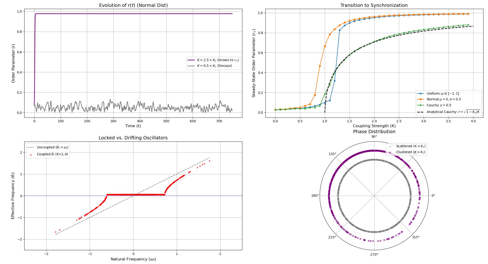

# Kuramoto Model: Dynamics and Transition to Synchronization

This repository contains a high-performance C++ simulation and Python visualization suite for the **Kuramoto Model** of coupled phase oscillators. It explores the temporal analog of a phase transition—spontaneous collective synchronization—using a self-consistent mean-field approach.

## Overview
The Kuramoto model describes a large population of interacting limit-cycle oscillators. By replacing $O(N^2)$ pair-wise network coupling with a macroscopic complex order parameter $r e^{i\psi}$, the system is analytically reduced to a mean-field interaction, allowing for highly efficient $O(N)$ numerical integration.

### Key Features
* **Mean-Field Optimization:** Simulates $N=1000$ oscillators with $O(N)$ computational complexity per step.
* **Phase Transitions:** Maps the pitchfork bifurcation to synchronization across Uniform, Normal, and Cauchy frequency distributions.
* **Exact Analytical Verification:** Compares numerical results against the closed-form exact integration of the Lorentzian (Cauchy) distribution: $r = \sqrt{1 - K_c/K}$.
* **Microscopic Dynamics:** Identifies partially synchronized states, capturing the theoretical plateau of "locked" oscillators alongside "drifting" distribution tails.

## Results

1. **Dynamics of Phase Coherence:** The order parameter $r(t)$ decays to $O(1/\sqrt{N})$ under subcritical coupling, but rapidly saturates to $r_\infty$ under supercritical coupling.
2. **Transition to Synchronization:** Sweeping the coupling strength $K$ reveals a continuous phase transition. The numerical Cauchy distribution impeccably tracks the exact analytical prediction.
3. **Locked vs. Drifting Oscillators:** At partially synchronized states ($K > K_c, r < 1$), the population bifurcates into a phase-locked central plateau ($\dot{\theta}_i = 0$) and drifting tails ($\dot{\theta}_i \approx \omega_i$).
4. **Stationary Phase Distribution:** Visualized on the unit circle, the locked oscillators form a dense rotating cluster, while the drifting oscillators form a stationary, non-uniform distribution to satisfy the self-consistency condition.



## Getting Started

### Prerequisites
* **C++ Compiler:** GCC or Clang (C++11 or higher)
* **Python 3.x:** With `numpy` and `matplotlib` installed.

### Running the Simulation
1. **Compile the C++ code:**
   ```bash
   g++ -O3 main.cpp -o kuramoto
   ```
   *(Note: The `-O3` flag enables maximum compiler optimization for faster execution).*

2. **Run the executable to generate data:**
   ```bash
   ./kuramoto
   ```
   This will generate several `.dat` files containing the time-series, transition sweeps, and phase snapshots.

3. **Generate the plots:**
   ```bash
   python plot.py
   ```
   This will read the `.dat` files and present the required plots.
```
